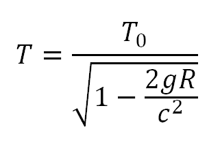
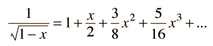

# General Relativity Time Dilation on Earth

## Project Statement

The aim of the project is plotting the time dilation based on gravity and height over geoid with contour lines on planet Earth.

## Dataset

The datasets available for the study were created through the .gdf files on the [ICGEM](http://icgem.gfz-potsdam.de/calcgrid?modeltype=celestial) website and partially based on the parameters shown below.

### EGM2008_world_gravity.gdf dataset info:

## Time Dilation:

### What is time dilation?

Gravitational time dilation is a form of time dilation, an actual difference of elapsed time between two events as measured by observers situated at varying distances from a gravitating mass. The lower the gravitational potential, the slower time passes, speeding up as the gravitational potential increases.

Gravitational time dilation was first described by Albert Einstein in 1907 as a consequence of special relativity in accelerated frames of reference. In general relativity, it is considered to be a difference in the passage of proper time at different positions as described by a metric tensor of space-time. The existence of gravitational time dilation was first confirmed directly by the Pound–Rebka experiment in 1959, and later refined by Gravity Probe A and other experiments.

Soruce:
 - https://en.wikipedia.org/wiki/Gravitational_time_dilation

The gravitational time dilation expression:

has such a small second term in the denominator that excessive numerical accuracy is required to evaluate it directly. Using a binomial expansion:

so that the first approximation to the time expression is:

  

The numerical values were calculated using g = grav (m/s2)array in MATLAB, R = R array in MATLAB (geoid height(m) + h_over_geoid(m)), and c=2.997E8 m/s.

## Time Dilation:

Since the time difference is very small, it is converted to fs (femtosecond). This unit is equivalent to 1E-15 seconds. 15389587415.8 fs value has been added on fs to indicate sensitivity and to indicate it on the graph.

**Calculating Time Dilation on MATLAB**

	% Calculating Time Dilation

	## A femtosecond is the SI unit of time equal to 10-15 or 
	## 1/1 000 000 000 000 000 of a second; that is, one quadrillionth,
	## or one millionth of one billionth, of a second.
	m=length(dat1);
	t_dil=zeros(m, 1);
	k = 1:m;
	  t_dil(k)=((1/sqrt((1-((2*dat1(k).*R(k))/c^2))))*1E15)-15389587415.8;
	  

### Earth Time Dilation Contour Graph

### Europe Time Dilation Contour Graph

 

### United States of America Time Dilation Contour Graph

 

If you want to plot 3D of contour map, please type these on command window:

    surf(X,Y,Z);
    xlabel('Longitude');
    ylabel('Latitude');
    zlabel('1 fs(femtosecond) - 15389587415.8');

## Contact Me

If you have something to say to me please contact me: 

 - Twitter: [Doguilmak](https://twitter.com/Doguilmak)
 - Mail address: doguilmak@gmail.com
 