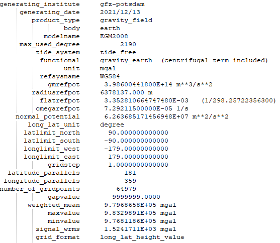
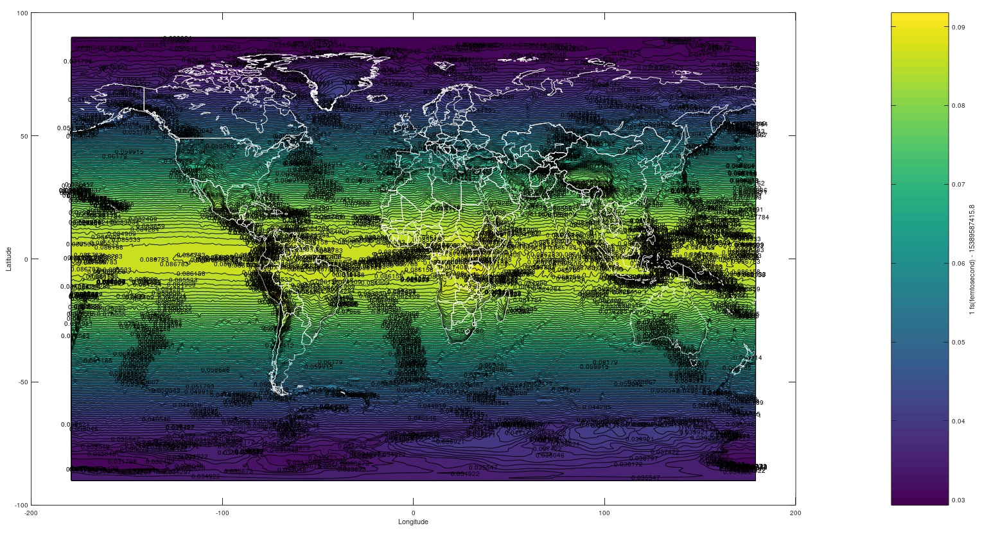
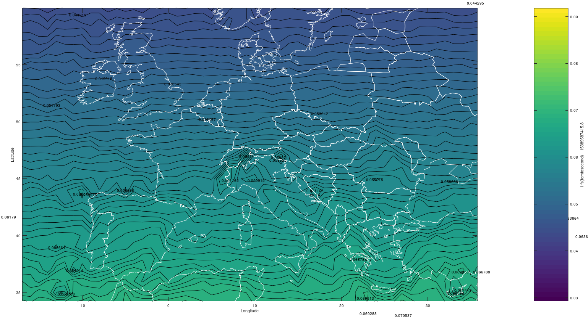
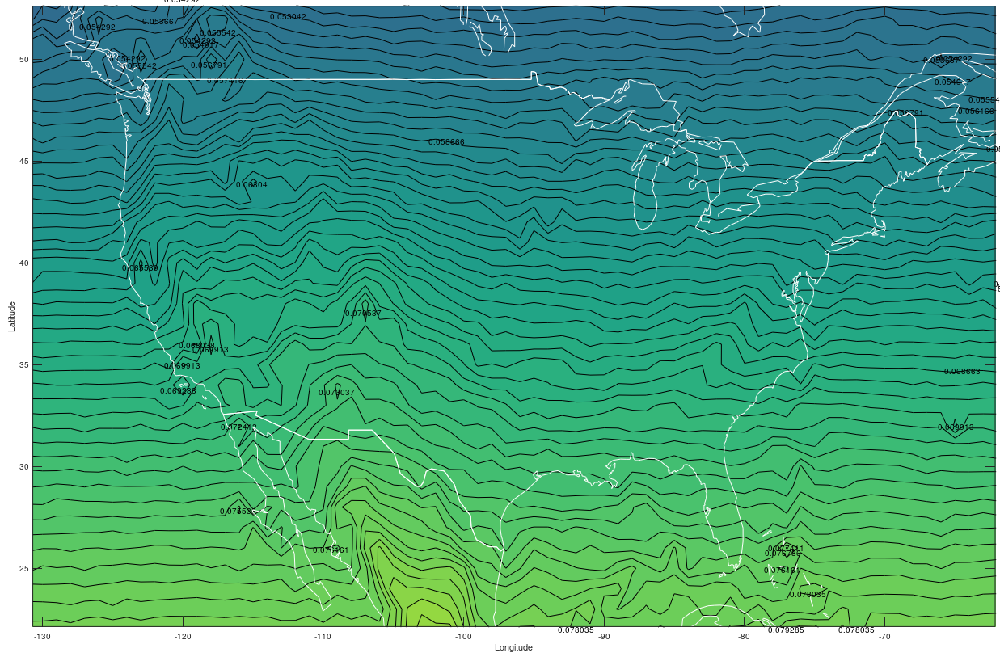
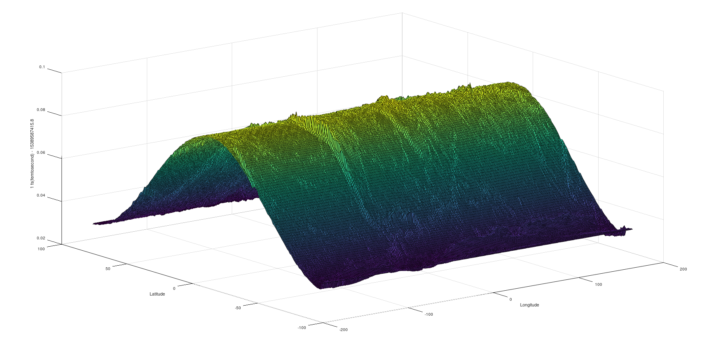

# General Relativity Time Dilation on Earth

## Project Statement

The aim of the project is plotting the time dilation based on gravity and height over geoid with contour lines on planet Earth. Time Dilation calculated over the gravitational data applied by the Earth. Gravity of other celestial bodies (Moon, Sun etc.) was ignored.

## Dataset

The datasets available for the study were created through the .gdf files on the [ICGEM](http://icgem.gfz-potsdam.de/calcgrid?modeltype=celestial) website and partially based on the parameters shown below.

### EGM2008_world_gravity.gdf dataset info:

     

## Time Dilation:

### What is time dilation?

Gravitational time dilation is a form of time dilation, an actual difference of elapsed time between two events as measured by observers situated at varying distances from a gravitating mass. The lower the gravitational potential, the slower time passes, speeding up as the gravitational potential increases.

Gravitational time dilation was first described by Albert Einstein in 1907 as a consequence of special relativity in accelerated frames of reference. In general relativity, it is considered to be a difference in the passage of proper time at different positions as described by a metric tensor of space-time. The existence of gravitational time dilation was first confirmed directly by the Pound–Rebka experiment in 1959, and later refined by Gravity Probe A and other experiments.

The gravitational time dilation expression:

 

$$T=\frac{T_0}{\sqrt{1-\frac{2\cdot g\cdot R}{c^2}}}$$

 

has such a small second term in the denominator that excessive numerical accuracy is required to evaluate it directly. Using a binomial expansion:

 

$$\frac{1}{\sqrt{1-x}} = 1 + \frac{x}{2} + \frac{3}{8} x^2 + \frac{5}{16} + x^3 + ...$$

 

so that the first approximation to the time expression is:

 

$$T=T_0 (1 + \frac{g\cdot R}{c^2} + \frac{3\cdot g^2\cdot R^2}{2\cdot c^4} + ...) = T_0 (1 + 6.95\cdot 10^{-10} + 7.2\cdot 10^{-19} + ...)$$

 

The numerical values were calculated using $g = grav (\frac{m}{s^2})$ array in MATLAB, $R = R$ array in MATLAB <code>(geoid height(m) + h_over_geoid(m))</code>, and $c=2.997\cdot10^{8} \frac{m}{s}$.

Soruces:
 - https://en.wikipedia.org/wiki/Gravitational_time_dilation
 - http://hyperphysics.phy-astr.gsu.edu/hbase/Relativ/gratim.html#c5 

 

## Time Dilation on MATLAB:

Since the time difference is very small, it is converted to [fs (femtosecond)](https://en.wikipedia.org/wiki/Femtosecond). This unit is equivalent to $10^{-15}$ seconds. $15389587415.8 fs$ value has been added on fs to indicate sensitivity and to indicate it on the graph.

**Calculating Time Dilation on MATLAB**

	% Calculating Time Dilation

	## A femtosecond is the SI unit of time equal to 10-15 or 
	## 1/1 000 000 000 000 000 of a second; that is, one quadrillionth,
	## or one millionth of one billionth, of a second.
	m=length(dat1);
	t_dil=zeros(m, 1);
	k = 1:m;
	  t_dil(k)=((1/sqrt((1-((2*dat1(k).*R(k))/c^2))))*1E15)-15389587415.8;
	  

### Earth Time Dilation Contour Plot

### Europe Time Dilation Contour Plot

 

### United States of America Time Dilation Contour Plot (Except Alaska State)

 

If you want to plot 3D of contour plot, please type these on command window:

    surf(X,Y,Z);
    xlabel('Longitude');
    ylabel('Latitude');
    zlabel('1 fs(femtosecond) - 15389587415.8');

## Contact Me

If you have something to say to me please contact me: 

 - Twitter: [Doguilmak](https://twitter.com/Doguilmak)
 - Mail address: doguilmak@gmail.com
 
